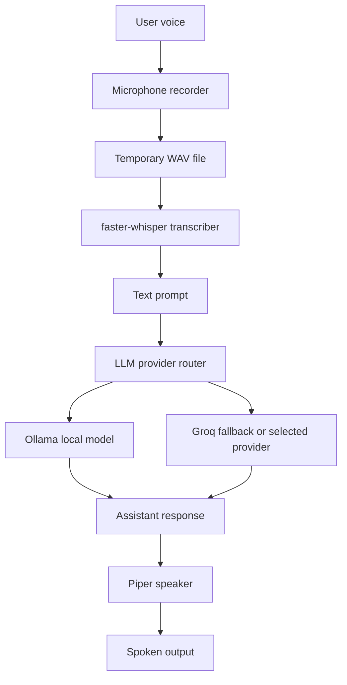

# AMIII Scalable Architecture

## Architecture Goal

AMIII should evolve without becoming a single giant script. Each capability must be replaceable, testable, and understandable by a beginner developer.

## System Layers

1. Interfaces: CLI, voice input, future UI, and future wake word listeners.
2. Orchestration: conversation engine and future task planner.
3. Intelligence: LLM provider abstraction with Ollama, Groq, and future providers.
4. Tools: desktop apps, browser automation, messaging, email, files, coding, GitHub, and research.
5. Memory: short-term session context first, SQLite-backed long-term memory later.
6. Safety: confirmation gates, secret handling, permission checks, and audit logs.
7. Documentation: feature specs, decision records, journal, contributions, and changelog.

## v0.1 Data Flow

## Provider Strategy

The app should not couple conversation logic to one model provider. Conversation code talks to a `ChatProvider` interface. Provider-specific modules handle HTTP requests, credentials, model names, timeouts, and error translation.

Provider modes:

- `ollama`: requires local Ollama.
- `groq`: requires `GROQ_API_KEY`.
- `auto`: tries Ollama first, then Groq if fallback is enabled.

## Safety Strategy

Before v1.0, every risky tool must pass through a confirmation service. Risky actions include sending messages, sending emails, deleting or moving files, running commands, committing code, changing system settings, or downloading files from the web.

## Extension Strategy

Future modules should follow this pattern:

1. define a small interface
2. implement one concrete adapter
3. write tests with mocks
4. add a feature document
5. add or update decision records when architecture changes

