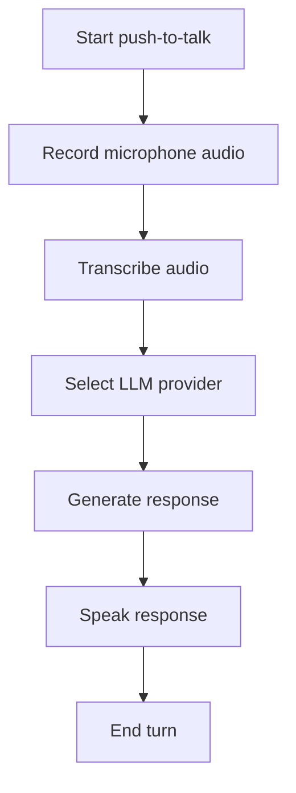

# Feature: Basic Voice Conversation

## Problem Statement

AMIII needs an initial interaction loop that feels like a voice assistant, not just a chatbot.

## Goal

Let the user speak a short prompt, convert it to text, get a response from a configured LLM provider, and hear that response spoken aloud.

## Scope

Included:

- push-to-talk recording
- faster-whisper transcription
- Ollama provider
- Groq provider
- auto fallback provider mode
- Piper text-to-speech
- clear setup errors

Excluded for v0.1:

- wake word activation
- continuous listening
- long-term memory
- autonomous tool execution
- messaging, browser, file, or coding actions

## Architecture

The conversation engine coordinates four replaceable parts:

- recorder
- transcriber
- LLM provider
- speaker

Each part is behind a small interface so tests can use fakes and future implementations can swap providers.

## Flow Diagram

## Dependencies

- Python
- sounddevice
- faster-whisper
- Ollama and a local model
- optional Groq API key
- Piper and a local voice model

## Risks

- Audio drivers may differ by machine.
- Local models may be slow on low-end hardware.
- Groq requires internet access and an API key.
- Piper setup requires a voice model file.

## Future Improvements

- wake word detection
- streaming transcription
- interruption support
- voice personality selection
- conversation memory

